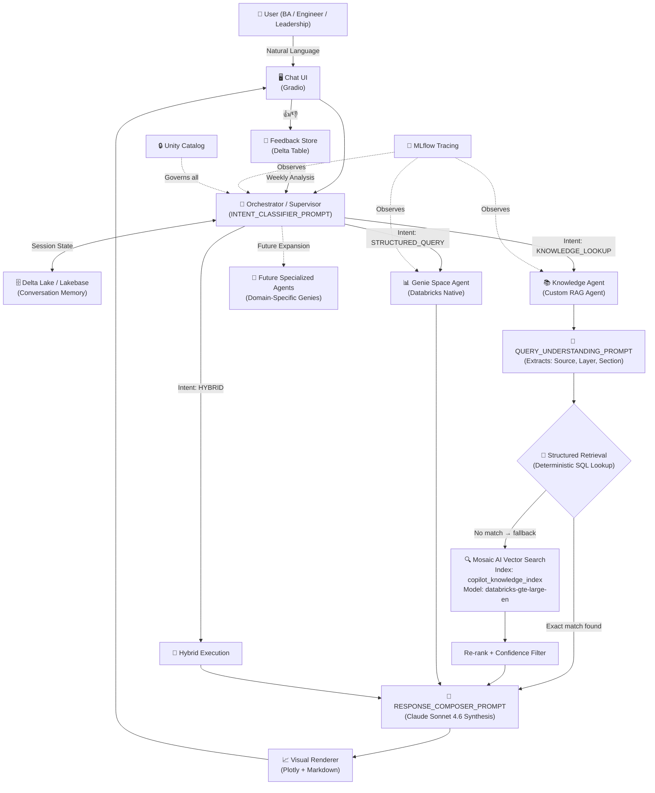

# 🏛️ DataPlatform Copilot Architecture Presentation

Here is the full architecture diagram and the step-by-step talking points to present to your Tech Lead. You can drop the Mermaid diagram below into tools like Draw.io, Notion, or GitHub to generate a clean visual slide.

## 📊 Full Architecture Diagram

---

## 🎤 Presentation Script

This script takes the Tech Lead through the entire end-to-end flow. It maintains a professional, collaborative tone while clearly defining the technical maturity and cost optimizations we have layered onto our approach.

### 1. Introduction & Architectural Context
*"Hi [Name], today I want to walk you through the target architecture for our eMobility DataPlatform Copilot.*

*To give some context, the other team has built a solid foundational architecture: they’ve implemented a router that delegates between Genie and a Vector Database. They currently rely primarily on Claude Sonnet 4.6 and standard Vector Search for documentation queries.*

*Our architecture builds upon those base concepts but introduces a series of deep optimizations specifically designed to **reduce token compute costs** and **increase precision**. We wanted to ensure that as the user adoption scales, our infrastructure costs and LLM latency remain tightly controlled."*

### 2. The Orchestrator & The `INTENT_CLASSIFIER_PROMPT`
*"Starting at the top, when a query comes in via our UI, it hits our Orchestrator.*

*The Orchestrator's primary role is traffic control, managed by our `INTENT_CLASSIFIER_PROMPT` (`STRUCTURED_QUERY`, `KNOWLEDGE_LOOKUP`, or `HYBRID`). 
By isolating this classification step, we don't need to load heavy context windows just to route a question. We can use heavy prompt caching, or even a smaller model like Haiku in the future, just for routing. This keeps the initial hop incredibly fast."*

### 3. The Specialized Agents
*"Once routed, the query triggers specialized agents. If it's a data question, we trigger the Databricks **Genie Space Agent** for guaranteed SQL determinism.*

*A major advantage of this decoupled design is on the right side of the diagram: **Future Specialized Agents**. We can horizontally plug in dozens of domain-specific Genies in the future—such as Finance or Supply Chain—without having to rewrite central code.*

*If the user asks an architecture or pipeline question, we route it to our custom **Knowledge Agent**."*

### 4. The Knowledge Agent: 'Structured-First' vs Pure Vector Search
*"This is where we’ve introduced our primary optimization.*

*A standard approach simply runs the user query against a Vector DB. While Vector Search is great for general questions, response times can vary, and it sometimes misses exact technical rules. 

*Instead, we implemented a **Structured-First** approach. We run the query through a `QUERY_UNDERSTANDING_PROMPT`. This parser extracts the structural entities—like the `source` system, data `layer`, or specific `section`.* 
*We use this to run a deterministic SQL Lookup against our Delta tables. If someone asks for Spirii EUH pipeline rules, we fetch that exact row instantly—completely bypassing massive vector scans and guaranteeing 100% accuracy.*

*If the question is broader, we confidently fall back to **Mosaic AI Vector Search**. We target our pre-prod index (`copilot_knowledge_index`) using Databricks' optimized embedding model (`databricks-gte-large-en`)."*

### 5. Final Synthesis: The `RESPONSE_COMPOSER_PROMPT`
*"Everything consolidates at the `RESPONSE_COMPOSER_PROMPT`.*

*This is where we intentionally spend our compute on **Claude Sonnet 4.6**. The Composer takes the strictly retrieved facts—whether from Genie, the structured lookup, or the Vector index—and formats the final output. Because we filtered out the noise upstream, we feed Sonnet 4.6 a highly curated, smaller context window. This reduces output token costs and prevents the model from hallucinating."*

### 6. Memory, Observability, and Governance
*"Finally, there are three critical backend pillars that make this production-ready:*

1. **Delta Lake / Lakebase**: *We use this for **Conversation Memory**. Language models are inherently stateless. By logging the session state into Lakebase, the Orchestrator can recall what the user asked three turns ago. This allows for natural, multi-turn follow-up questions without forcing the user to repeat themselves.*
2. **MLflow Tracing**: *When running multi-agent architectures, observability is crucial. MLflow Tracing silently monitors every single network hop, LLM call, and Vector DB query. This allows us to debug where latency spikes occur, monitor total token consumption per user, and evaluate exactly what context was fed to the model if a hallucination is reported.*
3. **Unity Catalog**: *Provides end-to-end governance so the Copilot perfectly respects Databricks row/column access controls.*

*In summary, we've taken a standard RAG/Genie pattern and infused it with structured parsing and model tiering to build a highly scalable, cost-efficient intelligence layer."*
