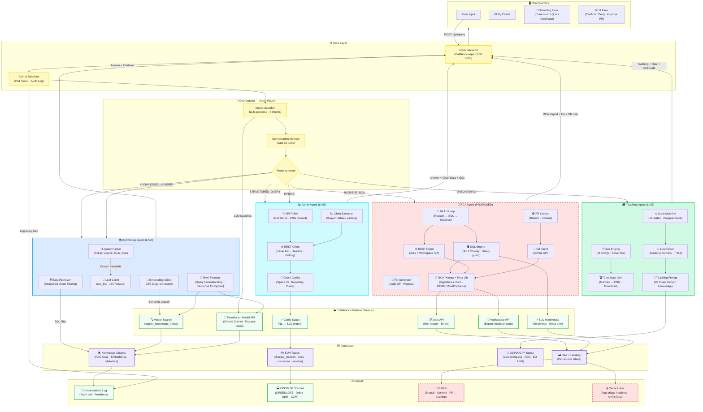

# eMobility CoPilot — Complete Architecture

## Architecture Diagram

---

## Explanation Script

### How to Walk Through the Diagram

> "Let me walk you through the full architecture of the **eMobility CoPilot** — what we've built, what's live, and what's proposed."

---

**Start at the top — the Chat Interface:**

> "Everything starts here. The user interacts with a premium chat interface — Claude/ChatGPT-style — deployed as a **Databricks App**. It supports rich markdown via Marked.js, interactive **Plotly.js** charts with custom animations — bars that grow, pies that spin, scatter with elastic bounce — an onboarding flow with quizzes and a downloadable certificate, and for the proposed RCA agent — confirm/deny buttons, code diff viewers, and PR links."

---

**Move down to the Core Layer — Flask Backend & Auth:**

> "Behind the UI, a lightweight **Flask backend** runs as a Databricks App on port 8000. No Model Serving needed — just REST endpoints: `/api/query` for all user messages, `/api/feedback` for thumbs up/down, and `/api/onboarding/reset` to restart the teaching flow. Auth is handled via **PAT tokens** from environment variables, and every single turn is audit-logged into a `copilot_conversations` Delta table — query, intent, response, latency, and user feedback."

---

**The Orchestrator — the brain of the system:**

> "Every message hits the **Intent Classifier** first — an LLM-powered router that categorizes the query into one of **five intents**:"
>
> - `KNOWLEDGE_LOOKUP` — *"How does Driivz deduplication work?"*
> - `STRUCTURED_QUERY` — *"How many chargers by country?"*
> - `HYBRID` — *"Why did session count drop and how does the pipeline handle it?"*
> - `ONBOARDING` — *"I'm new here, start my KT"*
> - `INCIDENT_RCA` — *"The Spirii EUH job failed, debug it"*
>
> "It maintains **conversation memory** — the last 10 turns with full answers — so users can have natural multi-turn conversations. The classification step is lightweight; we could even swap in a smaller model like Haiku just for routing to keep costs minimal."

---

**The four agent branches — this is where the real engineering lives:**

---

### 📚 Knowledge Agent (Blue Branch — LIVE)

> "This is our **RAG pipeline**, but we didn't do standard vector search — we implemented a **Structured-First** approach."
>
> "When a query comes in, the **Query Parser** uses an LLM to extract structured metadata — `source_name`, `data_layer`, `section_type`. The **SQL Retriever** then runs a deterministic SQL lookup against our `copilot_knowledge_chunks` Delta table. If someone asks 'What are the Spirii EUH pipeline rules?' — we fetch that exact row instantly via SQL. **100% accuracy, zero ambiguity**, completely bypassing vector scans."
>
> "If the structured lookup misses, we fall back to **Mosaic AI Vector Search** using `databricks-gte-large-en` embeddings (1024 dim). The **Embedding Client** generates the vector, and the **LLM Client** calls Claude Sonnet via Foundation Model API."
>
> "Everything converges at the **RAG Prompts** — a two-stage chain: Query Understanding (metadata extraction) → Response Composer (synthesize with citations). Because we filter noise upstream, Claude gets a highly curated, small context window. This **reduces token costs and prevents hallucination**."
>
> "Below that: **Vector Search** index (`copilot_knowledge_index`), **Foundation Model API** (Claude Sonnet, pay-per-token, ~$3/M input tokens, zero GPU management), **Knowledge Chunks** Delta table, and the **Conversations Log** for audit trailing."

---

### 📊 Genie Agent (Cyan Branch — LIVE)

> "For data questions — *'How many sessions did Spirii process last month?'* — we route to the **Genie Agent**. This leverages Databricks' native **Genie Space**, which translates natural language to SQL."
>
> "The **API Poller** calls Genie's REST API (`POST /api/2.0/genie/spaces/{id}/start-conversation`), then polls every 2 seconds for up to 120 seconds."
>
> "The **Chart Extractor** is where we got creative. Genie returns data in inconsistent formats, so we built a **3-layer fallback parser**: (1) Structured `data_array`, (2) Markdown table parser, (3) Regex pattern matching for `label: 1,234`. It auto-detects chart type — pie for ≤6 items, bar otherwise."
>
> "The data flows from our upstream **CPO/MSP sources** — GREENLOTS, Driivz, Spirii, EcoMovement, CXM — through the Landing → Raw → EUH pipeline, and lands in the **Enterprise Unified Hub** tables that Genie queries: `charger_location`, `charger_evse`, `charger_connector`, `charger_session`."

---

### 🎓 Teaching Agent (Green Branch — LIVE)

> "This is something unique — a **full LMS inside the chat**. A 7-module eMobility course with quizzes, a final test, and a downloadable certificate."
>
> "The **State Machine** manages 10 states: Welcome → Curriculum → Teaching → Doubt Check → Quiz → Final Test → Certificate. It tracks `current_module`, `scores[]`, and `quiz_progress`."
>
> "The **Quiz Engine** serves 3 MCQs per module + a 10-question final test. You need **80% to pass**, with a 20-minute time limit. Instant ✅/❌ feedback with explanations."
>
> "The key design: **no RAG for teaching**. Full domain knowledge is baked into a massive **~4K token system prompt** sourced from official specs — OCPI 2.2.1, OCPP 2.0.1, EU AFIR, IEC 62196. The agent is **adaptive** — it uses conversation history to explain concepts differently if the user didn't understand the first time."
>
> "The **Certificate Gen** produces a downloadable PNG via HTML Canvas."

---

### 🚨 RCA Agent (Red Branch — PROPOSED)

> "**This is the component we want your input and guidance on.**"
>
> "When Sharad and I were brainstorming this idea with **Amit**, he proposed something really powerful — integrating with **ServiceNow incidents**. That shaped the full vision for this agent."
>
> "The concept: an **autonomous SRE agent** that goes from **Error → Investigate → Diagnose → Fix → PR** without human intervention until the approval step."
>
> "Three sub-components:
>
> 1. **ReAct Loop** — The core investigation engine. Reason → Act → Observe cycle. LLM hypothesizes root cause, generates diagnostic SQL, executes it (read-only!), analyzes results. Max 5 iterations. Example: MERGE error → hypothesize blank `site_id` → generate `SELECT COUNT(*) WHERE site_id IS NULL` → confirmed!
>
> 2. **Fix Generator** — Once confirmed, generates a code fix. Shows original vs. proposed as a diff. Supports SQL and PySpark.
>
> 3. **PR Creator** — Creates branch (`task/fix-{source}-{issue}`), commits fix, opens PR to `develop`. **Never auto-merges** — engineer reviews."
>
> "The tools layer: **SQL Engine** (SELECT/DESCRIBE/SHOW only — hard-blocks all writes), **REST Client** (Jobs API for run history + error traces, Workspace API for notebook code export), **Git Client** (GitHub API for branch → commit → PR)."
>
> "The **RCA Prompt + Error Library** includes built-in patterns: MERGE duplicates → check blanks/nulls in merge keys, schema drift → DESCRIBE TABLE vs expected, cast errors → non-numeric strings. This library is **extensible** — we add patterns as the team encounters them."
>
> "Platform services: **Jobs API** for fetching failed runs, **SQL Warehouse** (serverless, read-only) for diagnostic queries, **Workspace API** for exporting notebook source code, and **Raw + Landing** tables where the agent investigates."
>
> "Two external integrations:
> - **GitHub (v1)**: Agent creates branches and PRs. Engineer reviews and merges.
> - **ServiceNow (v2 — Amit's idea)**: The game-changer. Instead of manual triggering, the agent **monitors SNOW for P1/P2 incidents**, auto-investigates, and posts root cause + proof + fix back to the ticket. This could significantly reduce our **MTTR metrics** that leadership tracks."

---

**The Databricks Platform layer:**

> "All agents share the same Databricks infrastructure — Foundation Model API for LLM calls (Claude Sonnet, pay-per-token), Vector Search for semantic retrieval, Genie Space for NL→SQL, SQL Warehouse for query execution, and Unity Catalog for governance. Every conversation turn is logged to a Delta table for full observability."

---

**Closing:**

> "So that's the full picture — four specialized agents, one intent-routing orchestrator, all running as a lightweight Databricks App with zero model-serving infrastructure. The Knowledge Agent, Genie Agent, and Teaching Agent are **live and working**. The RCA Agent is what we're proposing — and we'd love your guidance on the approach, GitHub integration scope, ServiceNow API access, and priority."
